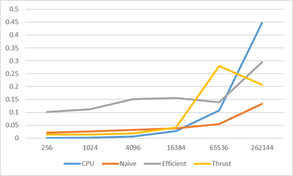
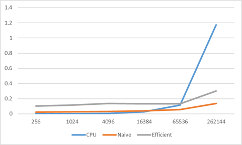
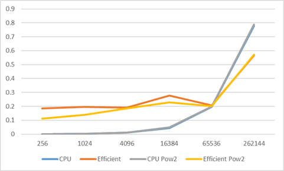

CUDA Stream Compaction
======================

**University of Pennsylvania, CIS 565: GPU Programming and Architecture, Project 2**

* Salaar Kohari
  * [LinkedIn](https://www.linkedin.com/in/salaarkohari), [personal website](http://salaar.kohari.com)
* Tested on: Windows 10, Intel Xeon @ 3.7GHz 32GB, GTX 1070 8GB (SIG Lab)

### Description
Scan and GPU Stream Compaction are two commonly parallelized problems for the GPU that come in handy as libraries for more sophisticated parallel algorithms. The goal of this project, in addition to implementing cpu, naive, and work-efficient scan and stream compaction, is to compare performance of different methods under various array sizes and analyze the results.

Scan involves processing a normally sequential action (such as summing an array) into a parallel one. The naive implementation involves summing two adjacent elements together then that sum with adjacent sums, etc to collapse the tree.

The work efficient implementation involves an up and down sweep of a balanced tree to minimize the number of scans and threads needed. This can be further optimized by reducing block size at each sum iteration to minimize wasted threads.

Stream compaction maps an array to 0s and 1s depending on if the value meets a condition (i.e. non-zero). Using a scan algorithm, new indices are chosen for the non-zero elements and a new array is constructed with those elements excluded.

### Analysis

Scan, (2^x)-3 Array Size

Scan, 2^x Array Size

Stream Compact

In the graphs above, scan and compact are compared for various array sizes and algorithm implementations. All numbers are based on the average of two runs, since random arrays cause variance in runtime. The graphs are split into power-of-2 array sizes and power-of-2 minus 3, since behavior of certain algorithms can cause the runtime to vary between these conditions. One thing to note was that the power-of-2 implementation of thrust took 4-5 seconds, so it was discluded from the results. This may have been due to thrust being slow the first time it is called.

CPU operations perform better at lower array size but becomes much slower at larger array sizes. This is because CPU has a faster clock and memory access for smaller array sizes, but this scales linearly with the size of the array as opposed to more logarithmically in the parallel approach. CPU also requires no memory transfer to the GPU which could be an additional bottleneck for low array sizes.

In my implementation, the naive approach performs better than the efficient one. This is likely because I did not optimize my block size at each iteration, so many threads are wasted at each implementation. There is also modulus division happening in the kernel to check if it is a valid thread, which is computationally inefficient on the GPU. If these are optimized, the efficient implementation would likely perform better.
